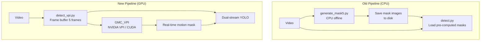

# GPU-Accelerated GMC Pipeline (NVIDIA VPI)

## Overview

Chuyển toàn bộ khâu tính toán motion mask từ **CPU (OpenCV)** sang **GPU (NVIDIA VPI/CUDA)**, tích hợp real-time vào pipeline detect.

## Architecture



## Files Created

| File | Description |
|------|-------------|
| [gmc_vpi.py](file:///d:/Algo_test_python/fast_yolo/utils/gmc_vpi.py) | Core GMC module — `GMC_VPI` (GPU) + `GMC_CPU` (fallback) |
| [detect_vpi.py](file:///d:/Algo_test_python/fast_yolo/detect_vpi.py) | New detect script with real-time GMC |

## GMC Pipeline Detail (per frame pair)

```mermaid
graph LR
    A[Frame Gray] --> B["GaussianBlur 11×11<br>vpi.gaussian_filter()"]
    B --> C["Build Pyramid<br>vpi.GaussianPyramid()"]
    C --> D["Optical Flow LK<br>vpi.optflow_pyr_lk()"]
    D --> E["Filter Outliers<br>dist < 50px"]
    E --> F["findHomography<br>RANSAC (CPU)"]
    F --> G["PerspWarp<br>vpi.perspwarp()"]
    G --> H[Compensated Frame]
    H --> I["absdiff → Motion Mask"]
    
    style B fill:#76b900
    style C fill:#76b900
    style D fill:#76b900
    style G fill:#76b900
```



> [!NOTE]
> Green = GPU (CUDA), White = CPU. `findHomography` remains on CPU because VPI's RANSAC transform estimator has limited availability. The data is small (hundreds of points) so this is not a bottleneck.

## FD5 Mask Logic (Bi-directional)

The motion mask uses **3 frames** (t-4, t-2, t) for temporal smoothing:

```
diff1 = |frame_t-2 − compensate(frame_t-4 → frame_t-2)|
diff2 = |frame_t-2 − compensate(frame_t   → frame_t-2)|
mask  = (diff1 + diff2) / 2
```

## API

### `GMC_VPI` / `GMC_CPU`
```python
from utils.gmc_vpi import create_gmc

gmc = create_gmc(prefer_gpu=True)

# Single pair
compensated, border_mask, avg_dist, mx, my, H = gmc.compute_mask(prev_gray, cur_gray)

# FD5-style 3-frame
motion_mask = gmc.compute_fd5_mask(frame_t4, frame_t2, frame_t)
```

### `detect_vpi.py` CLI
```bash
# GPU motion mask (default)
python detect_vpi.py --weights best.pt --source video.mp4 --device 0

# Force CPU fallback
python detect_vpi.py --weights best.pt --source video.mp4 --device 0 --gmc-cpu

# Debug: show motion mask window
python detect_vpi.py --weights best.pt --source video.mp4 --show-mask
```

## GPU Operations Breakdown

| Step | OpenCV (CPU) | VPI (GPU) | Speedup Expected |
|------|-------------|-----------|------------------|
| Gaussian Blur 11×11 | `cv2.GaussianBlur` | `vpi.gaussian_filter` | ~5-10× |
| Optical Flow LK | `cv2.calcOpticalFlowPyrLK` | `vpi.optflow_pyr_lk` | ~10-20× |
| Perspective Warp | `cv2.warpPerspective` | `vpi.perspwarp` | ~5-15× |
| Homography (RANSAC) | `cv2.findHomography` | `cv2.findHomography` | Same (CPU) |

> [!IMPORTANT]
> **Requirements**: NVIDIA VPI must be installed. On Jetson: pre-installed. On desktop Linux: `sudo apt install python3-vpi3`. On Windows: VPI is available via the NVIDIA SDK Manager or as a standalone package — check [NVIDIA VPI Downloads](https://developer.nvidia.com/vpi).

> [!TIP]
> If VPI is not available, the system automatically falls back to `GMC_CPU` which uses the exact same OpenCV-based logic as the original `MOD_Functions.motion_compensate()`.
