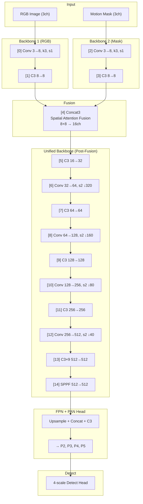
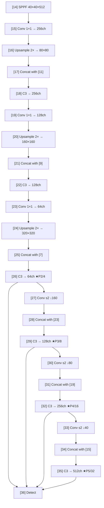

# Phân Tích Kiến Trúc YOLO Dual-Stream (YOLOMG)

## 1. Tổng Quan Kiến Trúc

Model này là một biến thể **dual-stream** (2 luồng đầu vào) của YOLOv5, được thiết kế cho bài toán phát hiện drone/UAV. Điểm khác biệt cốt lõi so với YOLOv5 gốc:

- **2 backbone riêng biệt**: backbone1 (RGB), backbone2 (motion mask)
- **Attention-based fusion**: dùng `Concat3` (Spatial Attention) để fuse 2 luồng
- **CBAM**: Channel + Spatial Attention refine features sau fusion



---

## 2. Tham Số Cấu Hình (YAML)

Dựa trên file [NPS_uav_s.yaml](file:///d:/Algo_test_python/fast_yolo/models/NPS_uav_s.yaml):

| Tham số | Giá trị | Ý nghĩa |
|---------|---------|---------|
| `nc` | 1 | 1 class (drone/UAV) |
| `depth_multiple` | 0.33 | Hệ số depth (tương đương YOLOv5s) |
| `width_multiple` | 0.50 | Hệ số width (tương đương YOLOv5s) |
| `backbone1depth` | 2 | Backbone1 có 2 layer (index 0-1), từ index 2 trở đi là backbone2 |
| `anchors` | 4 (auto) | Auto-anchor, 4 scale detection |

So sánh với [dual_uav2.yaml](file:///d:/Algo_test_python/fast_yolo/models/dual_uav2.yaml) — cấu hình nhỏ hơn với 3-scale detect thay vì 4-scale.

> [!NOTE]
> `backbone1depth: 2` là tham số quyết định — nó cho `parse_model()` biết **2 layer đầu** thuộc backbone1 (RGB), còn lại thuộc backbone2 (mask + fusion).

---

## 3. Chi Tiết Từng Phần

### 3.1 Backbone 1 — Trích xuất đặc trưng RGB

📍 Định nghĩa: [NPS_uav_s.yaml L19-23](file:///d:/Algo_test_python/fast_yolo/models/NPS_uav_s.yaml#L19-L23)  
📍 Forward logic: [yolo.py L150-153](file:///d:/Algo_test_python/fast_yolo/models/yolo.py#L150-L153)

```yaml
backbone1:
  [[-1, 1, Conv, [8, 3, 1, 1]],   # [0] Conv: 3→8, kernel=3, stride=1, padding=1
   [-1, 3, C3, [8]],]             # [1] C3:  8→8, 3 bottleneck (×depth_multiple)
```

**Forward**: Khi `m.i < backbone1depth`, chỉ `x1` (RGB) đi qua layer, `x2` (mask) giữ nguyên:
```python
# yolo.py:150-153
if m.i < self.backbone1depth:
    x1 = m(x1)        # RGB qua layer
    x2 = x2           # mask giữ nguyên
    y.append(x1 if m.i in self.save else None)
```

### 3.2 Backbone 2 — Trích xuất + Fusion + Deep Features

📍 Định nghĩa: [NPS_uav_s.yaml L25-44](file:///d:/Algo_test_python/fast_yolo/models/NPS_uav_s.yaml#L25-L44)  
📍 Forward logic: [yolo.py L154-172](file:///d:/Algo_test_python/fast_yolo/models/yolo.py#L154-L172)

```yaml
backbone2:
  [[-1, 1, Conv, [8, 3, 1, 1]],       # [2] Mask Conv: 3→8
   [-1, 3, C3, [8]],                   # [3] Mask C3:   8→8
   [[-1, 1], 1, Concat3, [16,1]],      # [4] ★ FUSION: Concat3 attention merge
   [-1, 3, C3, [32]],                  # [5] Post-fusion C3
   [-1, 1, Conv, [64, 3, 2]],          # [6] Downsample ↓320×320
   [-1, 3, C3, [64]],                  # [7] 
   [-1, 1, Conv, [128, 3, 2]],         # [8] Downsample ↓160×160
   [-1, 3, C3, [128]],                 # [9]
   [-1, 1, Conv, [256, 3, 2]],         # [10] Downsample ↓80×80
   [-1, 3, C3, [256]],                 # [11]
   [-1, 1, Conv, [512, 3, 2]],         # [12] Downsample ↓40×40
   [-1, 9, C3, [512]],                 # [13] Deep C3 (9 bottlenecks)
   [-1, 1, SPPF, [512, 5]],]           # [14] SPPF pooling
```

**Concat3 Forward** — đây là nơi 2 luồng gặp nhau:

```python
# yolo.py:156-168
if m.type == 'models.common.Concat3':
    for j in m.f:
        if j == -1:
            x2 = x2       # mask stream (previous layer output)
        else:
            x1 = y[j]     # RGB stream (from saved backbone1 output)
    x2 = m(x2, x1)        # ← Concat3(mask_features, rgb_features)
```

### 3.3 Detection Head — FPN + PAN (NPS_uav_s: 4-scale)

📍 Định nghĩa: [NPS_uav_s.yaml L47-77](file:///d:/Algo_test_python/fast_yolo/models/NPS_uav_s.yaml#L47-L77)



> [!IMPORTANT]
> Khác với YOLOv5 gốc (3 scale: P3/P4/P5), model NPS_uav_s dùng **4 scale** (P2/P3/P4/P5) — thêm P2 để detect drone rất nhỏ ở scale 320×320.

### 3.4 Detect Layer

📍 Code: [yolo.py L33-84](file:///d:/Algo_test_python/fast_yolo/models/yolo.py#L33-L84)

```python
class Detect(nn.Module):
    def __init__(self, nc=80, anchors=(), ch2=(), inplace=True):
        self.nc = nc              # 1 class
        self.no = nc + 5          # outputs per anchor = 6 (4 bbox + 1 obj + 1 cls)
        self.nl = len(anchors)    # 4 detection layers (P2-P5)
        self.na = len(anchors[0]) // 2  # anchors per layer
        self.m = nn.ModuleList(nn.Conv2d(x, self.no * self.na, 1) for x in ch2)
```

**Decode logic** (inference):
```python
y = x[i].sigmoid()
y[..., 0:2] = (y[..., 0:2] * 2 - 0.5 + self.grid[i]) * self.stride[i]  # xy
y[..., 2:4] = (y[..., 2:4] * 2) ** 2 * self.anchor_grid[i]              # wh
```

---

## 4. Thuật Toán Attention Chi Tiết

### 4.1 Concat3 — Spatial Attention Fusion

📍 Code: [common.py L119-134](file:///d:/Algo_test_python/fast_yolo/models/common.py#L119-L134)

Đây là **module fusion chính** giữa RGB và motion mask:

```python
class Concat3(nn.Module):
    def __init__(self, c1, c2, ratio=16, kernel_size=7, dimension=1):
        self.spatial_attention = SpatialAttention(7)
        self.channel_attention = ChannelAttention(c1, ratio)

    def forward(self, x1, x2):                    # x1=mask_feat, x2=rgb_feat
        weight1 = self.spatial_attention(x1)       # spatial weight cho mask
        weight2 = self.spatial_attention(x2)       # spatial weight cho RGB
        weight = weight1 / weight2                 # tỷ số attention
        x2 = weight * x2                           # scale RGB
        x1 = x1 * (2 - weight)                     # scale mask (bù trừ)
        x = torch.cat((x1, x2), self.d)            # concat
        X = self.channel_attention(x)               # channel refine (unused in return!)
        return x
```

**Ý tưởng**: 
- Tính `weight = spatial_attn(mask) / spatial_attn(rgb)`
- Nếu mask có attention cao hơn RGB → `weight > 1` → mask được nhấn mạnh (`2-weight < 1`), RGB bị giảm
- Nếu RGB dominant → `weight < 1` → RGB giữ nguyên, mask bị giảm
- Đảm bảo tổng trọng số = 2 (conservation: `weight + (2-weight) = 2`)

### 4.2 SpatialAttention (cho Concat3)

📍 Code: [common.py L98-117](file:///d:/Algo_test_python/fast_yolo/models/common.py#L98-L117)

```python
class SpatialAttention(nn.Module):
    def forward(self, x):
        avg_out = torch.mean(x, dim=1, keepdim=True)   # channel-wise mean
        max_out, _ = torch.max(x, dim=1, keepdim=True)  # channel-wise max
        x = torch.cat([avg_out, max_out], dim=1)         # 2ch feature
        x = self.conv(x)                                  # Conv2d(2→1, k=7)
        x1 = torch.mean(x)                                # global mean scalar
        x2 = torch.max(x)                                 # global max scalar
        x = x1 + x2                                       # combined scalar
        return self.sigmoid(x)                             # → [0, 1] weight
```

### 4.3 ChannelAttention (cho Concat3)

📍 Code: [common.py L75-95](file:///d:/Algo_test_python/fast_yolo/models/common.py#L75-L95)

```python
class ChannelAttention(nn.Module):
    def forward(self, x):
        avg_out = self.f2(self.relu(self.f1(self.avg_pool(x))))  # GAP → FC → ReLU → FC
        max_out = self.f2(self.relu(self.f1(self.max_pool(x))))  # GMP → FC → ReLU → FC
        return self.sigmoid(avg_out + max_out)                    # per-channel weight
```

### 4.4 CBAM — Standalone Attention Block

📍 Code: [common.py L136-154](file:///d:/Algo_test_python/fast_yolo/models/common.py#L136-L154)

CBAM dùng phiên bản **riêng biệt** của Channel/Spatial Attention (`ChannelAttention2` + `SpatialAttention2`):

```python
class CBAM(nn.Module):
    def forward(self, x):
        out = self.channel_attention(x) * x   # channel attention → scale
        out = self.spatial_attention(out) * out  # spatial attention → scale
        return out
```

### 4.5 SpatialAttention2 (Gaussian-enhanced, cho CBAM)

📍 Code: [common.py L176-199](file:///d:/Algo_test_python/fast_yolo/models/common.py#L176-L199)

Khác với `SpatialAttention` gốc — dùng **2 nhánh** (max + min) và **Gaussian activation**:

```python
class SpatialAttention2(nn.Module):
    def forward(self, x):
        # Nhánh 1: avg + max
        x1 = self.conv(torch.cat([torch.mean(x,1,True), torch.max(x,1,True)[0]], 1))
        # Nhánh 2: avg + min  
        x2 = self.conv(torch.cat([torch.mean(x,1,True), torch.min(x,1,True)[0]], 1))
        # Fuse cả 2 nhánh
        x = self.conv(torch.cat([x1, x2], dim=1))
        # ★ Gaussian activation thay vì simple sigmoid
        x = torch.exp(-(x - 0.5)**2 / (2 * 1**2)) / (math.sqrt(2*math.pi) * 1)
        return self.sigmoid(x)
```

> [!TIP]
> Gaussian activation `exp(-(x-0.5)²/2)` tạo response dạng chuông quanh 0.5, khiến attention tập trung hơn vào vùng có response trung bình — hiệu quả cho phát hiện object nhỏ nơi contrast không quá mạnh.

---

## 5. Các Module Backbone Khác

### 5.1 Conv — Convolution chuẩn
📍 Code: [common.py L339-351](file:///d:/Algo_test_python/fast_yolo/models/common.py#L339-L351)

```python
Conv = Conv2d + BatchNorm2d + SiLU
```

### 5.2 C3 — CSP Bottleneck with 3 Convolutions
📍 Code: [common.py L426-438](file:///d:/Algo_test_python/fast_yolo/models/common.py#L426-L438)

```
x ──→ Conv1×1 ──→ N×Bottleneck ──→ ┐
  └──→ Conv1×1 ────────────────────→ Concat ──→ Conv1×1 ──→ out
```

### 5.3 SPPF — Spatial Pyramid Pooling Fast
📍 Code: [common.py L1048-1063](file:///d:/Algo_test_python/fast_yolo/models/common.py#L1048-L1063)

```
x ──→ Conv ──→ MaxPool(5) ──→ MaxPool(5) ──→ MaxPool(5)
               │              │              │
               └──── Concat(x, y1, y2, y3) ──→ Conv ──→ out
```
Tương đương SPP(5,9,13) nhưng nhanh hơn bằng cách cascade 3 lần MaxPool(5).

### 5.4 CARAFE — Content-Aware ReAssembly of FEatures
📍 Code: [common.py L33-73](file:///d:/Algo_test_python/fast_yolo/models/common.py#L33-L73)

Upsampling module học được — thay thế bilinear interpolation. Chưa dùng trong YAML hiện tại nhưng sẵn sàng.

### 5.5 ShuffleBlock — Channel Shuffle
📍 Code: [common.py L1097-1142](file:///d:/Algo_test_python/fast_yolo/models/common.py#L1097-L1142)

Depthwise separable conv + channel shuffle cho lightweight inference.

### 5.6 MobileOneBlock — Re-parameterizable Block  
📍 Code: [common.py L237-318](file:///d:/Algo_test_python/fast_yolo/models/common.py#L237-L318)

Multi-branch training (k branches of 3×3 + 1×1 + BN identity) → merge thành single Conv khi deploy.

---

## 6. Multi-Backend Inference

📍 Code: [common.py L600-804](file:///d:/Algo_test_python/fast_yolo/models/common.py#L600-L804)

### DetectMultiBackend — Hỗ trợ nhiều backend

| Backend | Format | Forward dual-input |
|---------|--------|--------------------|
| **PyTorch** | `.pt` | `model(im, im2)` — native dual-stream |
| **TorchScript** | `.torchscript` | `model(im, im2)` |
| **TensorRT** | `.engine` | 2 bindings: `images1` + `images2` → [common.py L750-760](file:///d:/Algo_test_python/fast_yolo/models/common.py#L750-L760) |
| **ONNX** | `.onnx` | Single input only (cần custom export) |
| **OpenVINO** | `.xml` | Single input only |

**TensorRT dual-input** (đoạn quan trọng nhất cho bạn):

```python
# common.py:750-760
if 'images1' in self.bindings and 'images2' in self.bindings:
    if im.shape == self.bindings['images1'].shape:
        self.binding_addrs['images1'] = int(im.data_ptr())   # RGB
        self.binding_addrs['images2'] = int(im2.data_ptr())  # Mask
    else:
        self.bindings['images1'].data[:b] = im               # padding
        self.bindings['images2'].data[:b] = im2
```

> [!WARNING]
> ONNX và OpenVINO chỉ hỗ trợ **single input** trong code hiện tại. Muốn export dual-input sang ONNX/OpenVINO cần custom lại `export.py`.

---

## 7. Forward Flow Chi Tiết

📍 Code: [yolo.py L147-181](file:///d:/Algo_test_python/fast_yolo/models/yolo.py#L147-L181)

```python
def _forward_once(self, x1, x2, profile=False, visualize=False):
    y, dt = [], []
    for m in self.model:
        if m.i < self.backbone1depth:          # ← Layer 0,1 (backbone1)
            x1 = m(x1)                         #   chỉ RGB đi qua
            y.append(x1 if m.i in self.save else None)
        else:                                   # ← Layer 2+ (backbone2 + head)
            if m.type == 'models.common.Concat3':
                x2 = m(x2, x1)                 #   ★ fusion point
            else:
                x2 = m(x2)                      #   mask stream đi qua
            y.append(x2 if m.i in self.save else None)
    return x2
```

**Tóm lại data flow**:

```
Frame t:
  RGB  ──→ [0]Conv → [1]C3 ──────────────────────────────┐
  Mask ──→ [2]Conv → [3]C3 → [4]Concat3(mask, rgb) ──→ unified ──→ head ──→ Detect
                              ↑ Spatial Attention Fusion
```

---

## 8. Tóm Tắt Các Thuật Toán Sử Dụng

| # | Thuật toán | Vị trí | Mục đích |
|---|-----------|--------|----------|
| 1 | **Dual-stream backbone** | [yolo.py L150-172](file:///d:/Algo_test_python/fast_yolo/models/yolo.py#L150-L172) | Xử lý riêng RGB và mask trước khi fuse |
| 2 | **Spatial Attention Fusion** (Concat3) | [common.py L119-134](file:///d:/Algo_test_python/fast_yolo/models/common.py#L119-L134) | Tự học trọng số RGB vs mask theo không gian |
| 3 | **CBAM** | [common.py L136-199](file:///d:/Algo_test_python/fast_yolo/models/common.py#L136-L199) | Channel + Spatial attention refine |
| 4 | **Gaussian Spatial Activation** | [common.py L198](file:///d:/Algo_test_python/fast_yolo/models/common.py#L198) | Attention response tập trung vùng trung bình |
| 5 | **CSP Bottleneck (C3)** | [common.py L426-438](file:///d:/Algo_test_python/fast_yolo/models/common.py#L426-L438) | Cross-stage partial connection cho gradient flow |
| 6 | **SPPF** | [common.py L1048-1063](file:///d:/Algo_test_python/fast_yolo/models/common.py#L1048-L1063) | Multi-scale feature aggregation |
| 7 | **FPN + PAN** | [NPS_uav_s.yaml L47-76](file:///d:/Algo_test_python/fast_yolo/models/NPS_uav_s.yaml#L47-L76) | Bi-directional feature pyramid |
| 8 | **4-scale Detection** | [NPS_uav_s.yaml L76](file:///d:/Algo_test_python/fast_yolo/models/NPS_uav_s.yaml#L76) | P2/P3/P4/P5 để detect drone nhỏ |
| 9 | **Auto-anchor** | [yolo.py L119-120](file:///d:/Algo_test_python/fast_yolo/models/yolo.py#L119-L120) | Tự tính anchor từ dataset |
| 10 | **TensorRT dual-binding** | [common.py L750-760](file:///d:/Algo_test_python/fast_yolo/models/common.py#L750-L760) | GPU inference với 2 input tensors |
| 11 | **MobileOne re-param** | [common.py L237-318](file:///d:/Algo_test_python/fast_yolo/models/common.py#L237-L318) | Multi-branch train → single conv deploy |
| 12 | **CARAFE upsampling** | [common.py L33-73](file:///d:/Algo_test_python/fast_yolo/models/common.py#L33-L73) | Content-aware learned upsampling |
